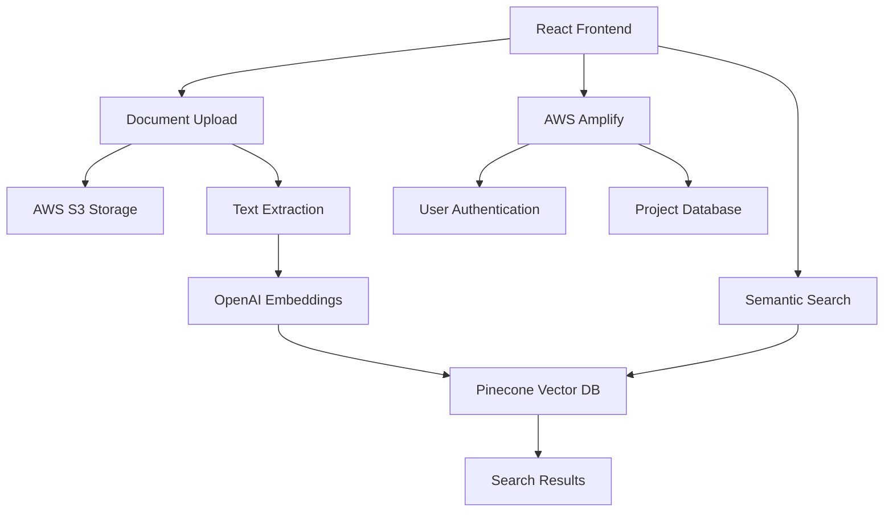

# 🏗️ Jacq of All Trades

> **AI-Powered Construction Document Management Platform**  
> Intelligent document organization, semantic search, and project collaboration for the construction industry.

[](https://www.typescriptlang.org/)
[](https://reactjs.org/)
[](https://aws.amazon.com/)
[](https://www.pinecone.io/)
[](https://openai.com/)

---

## 🚀 **What is Jacq of All Trades?**

Jacq of All Trades revolutionizes construction project management by combining traditional document storage with cutting-edge AI technology. Upload blueprints, contracts, specifications, and reports - then find exactly what you need using natural language queries or voice commands.

### ✨ **Key Features**

🤖 **AI-Powered Search**

- Semantic search across all documents using natural language
- Voice-to-text search functionality
- Contextual understanding of construction terminology

📂 **Smart Document Management**

- Automatic text extraction from PDFs, Word docs, and images
- Project-based organization and access control
- Real-time document processing and indexing

🏢 **Multi-Company Support**

- Company-specific workspaces and permissions
- Project collaboration and sharing
- Role-based access management

⚡ **Modern Architecture**

- Real-time document processing
- Cloud-native infrastructure
- Mobile-responsive design

---

## 🎯 **Perfect For**

- **Construction Companies** managing multiple projects
- **Architects & Engineers** organizing technical documents
- **Project Managers** coordinating team communications
- **Contractors** accessing specifications and plans on-site

---

## 🛠️ **Technology Stack**

### **Frontend**

- **React 18** with TypeScript
- **Tailwind CSS** for styling
- **Radix UI** components
- **Vite** for blazing-fast development

### **Backend & AI**

- **AWS Amplify** for authentication & database
- **OpenAI GPT** for embeddings generation
- **Pinecone** vector database for semantic search
- **AWS S3** for document storage

### **Key Integrations**

- **PDF.js** for document text extraction
- **Google Places API** for project locations
- **Speech-to-Text** for voice queries

---

## 🚀 **Quick Start**

### **Prerequisites**

```bash
node >= 18.0.0
npm >= 8.0.0
```

### **Installation**

1. **Clone the repository**

```bash
git clone https://github.com/roscolil/scopeiq.git
cd scopeiq
```

2. **Install dependencies**

```bash
npm install
```

3. **Environment setup**

```bash
cp .env.example .env
```

4. **Configure your environment variables**

```env
# OpenAI Configuration
VITE_OPENAI_API_KEY=your_openai_api_key

# Pinecone Configuration
VITE_PINECONE_API_KEY=your_pinecone_api_key

# AWS Configuration
VITE_AWS_REGION=your_aws_region
VITE_AWS_ACCESS_KEY_ID=your_access_key
VITE_AWS_SECRET_ACCESS_KEY=your_secret_key
VITE_AWS_S3_BUCKET=your_s3_bucket

# Google Places (Optional)
VITE_GOOGLE_PLACES_API_KEY=your_google_places_key
```

5. **Start development server**

```bash
npm run dev
```

Visit `http://localhost:8080` to see your application! 🎉

---

## 📖 **Documentation**

### **Core Documentation**

- [**User Management & Authentication**](USER_MANAGEMENT.md) - Complete guide to our hybrid auth system
- [**Deployment Checklist**](DEPLOYMENT_CHECKLIST.md) - Step-by-step deployment verification
- [**Data Structure Guide**](DATA_STRUCTURE.md) - Database schema and relationships
- [**Security Guide**](SECURITY.md) - Security best practices and compliance

### **Usage Guide**

### **1. Project Creation**

```typescript
// Create a new construction project
const project = await projectService.createProject(companyId, {
  name: 'Downtown Office Complex',
  description: '50-story mixed-use development',
  address: '123 Main St, City, State',
})
```

### **2. Document Upload**

- Drag & drop files or use the upload button
- Supported formats: PDF, DOC/DOCX, TXT, images
- Automatic text extraction and AI indexing

### **3. Semantic Search**

```typescript
// Search using natural language
const results = await semanticSearch({
  projectId: 'project-123',
  query: 'structural steel specifications for floors 10-20',
  topK: 5,
})
```

### **4. Voice Search**

- Click the microphone icon
- Speak your query naturally
- Get instant results from your documents

---

## 🏗️ **Architecture Overview**



### **Document Processing Pipeline**

1. **Upload** → Document stored in AWS S3
2. **Extract** → Text content extracted using PDF.js
3. **Embed** → OpenAI generates semantic embeddings
4. **Index** → Embeddings stored in Pinecone vector database
5. **Search** → Natural language queries find relevant documents

---

## 🔧 **Development**

### **Available Scripts**

```bash
npm run dev          # Start development server
npm run build        # Build for production
npm run preview      # Preview production build
npm run lint         # Run ESLint
npm run format       # Format code with Prettier
```

### **Project Structure**

```
src/
├── components/          # Reusable UI components
│   ├── ui/             # Base UI components (shadcn/ui)
│   ├── FileUploader.tsx
│   ├── AIActions.tsx
│   └── ...
├── pages/              # Application pages
│   ├── Projects.tsx
│   ├── ProjectDetails.tsx
│   └── ...
├── services/           # Business logic & API calls
│   ├── embedding.ts
│   ├── pinecone.ts
│   └── ...
├── hooks/              # Custom React hooks
├── types/              # TypeScript type definitions
└── utils/              # Utility functions
```

### **Adding New Features**

1. **Create feature branch**

```bash
git checkout -b feature/your-feature-name
```

2. **Implement your feature**

```bash
# Add components, services, or pages
# Follow existing patterns and TypeScript conventions
```

3. **Test thoroughly**

```bash
npm run lint
npm run build
```

4. **Submit pull request**

```bash
git push origin feature/your-feature-name
```

---

## 🤝 **Contributing**

We welcome contributions! Please see our [Contributing Guide](CONTRIBUTING.md) for details.

### **Development Guidelines**

- Use TypeScript for all new code
- Follow existing component patterns
- Add proper error handling
- Write descriptive commit messages
- Test your changes thoroughly

---

## 📈 **Roadmap**

### **🎯 Current (Q4 2024)**

- ✅ Core document management
- ✅ AI-powered semantic search
- ✅ Voice search functionality
- ✅ Multi-company support

### **🚀 Next Quarter (Q1 2025)**

- 📱 Mobile app development
- 🔄 Real-time collaboration
- 📊 Advanced analytics dashboard
- 🤖 AI document summarization

### **🌟 Future Features**

- 🏗️ 3D model integration
- 📋 Automated compliance checking
- 🔗 Third-party integrations (Procore, PlanGrid)
- 🌐 Offline functionality

---

## 📄 **License**

This project is licensed under the MIT License - see the [LICENSE](LICENSE) file for details.

---

## 🆘 **Support**

Need help? We're here for you!

- 📧 **Email**: support@scopeiq.com
- 💬 **Discord**: [Join our community](https://discord.gg/scopeiq)
- 📖 **Documentation**: [docs.scopeiq.com](https://docs.scopeiq.com)
- 🐛 **Bug Reports**: [GitHub Issues](https://github.com/roscolil/scopeiq/issues)

---

## 🏆 **Why Jacq of All Trades?**

> _"Before Jacq of All Trades, finding the right specification took hours. Now it takes seconds."_  
> — **Sarah Chen**, Project Manager at BuildTech Solutions

> _"The voice search feature is a game-changer when you're on-site with dirty hands."_  
> — **Mike Rodriguez**, Site Supervisor at Metro Construction

---

<div align="center">

### **Ready to revolutionize your construction document management?**

[🚀 **Get Started**](https://scopeiq.com) • [📖 **Documentation**](https://docs.scopeiq.com) • [💬 **Contact Us**](mailto:hello@scopeiq.com)

---

</div>
