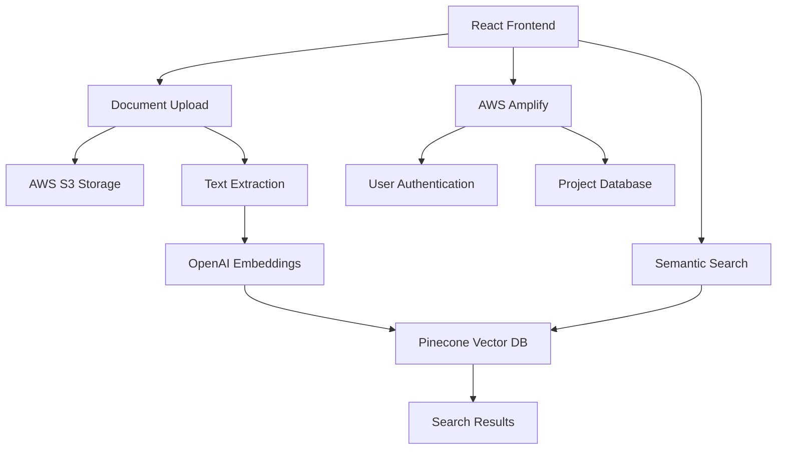

# 🏗️ Jack of All Trades

> **AI-Powered Construction Document Management Platform**  
> Intelligent document organization, semantic search, and project collaboration for the construction industry.

[](https://www.typescriptlang.org/)
[](https://reactjs.org/)
[](https://aws.amazon.com/)
[](https://www.pinecone.io/)
[](https://openai.com/)

---

## 🚀 **What is Jack of All Trades?**

Jack of All Trades (formerly ScopeIQ) revolutionizes construction project management by combining traditional document storage with cutting-edge AI technology. Upload blueprints, contracts, specifications, and reports - then find exactly what you need using natural language queries, voice commands, or biometric authentication.

### ✨ **Key Features**

🤖 **AI-Powered Search & Analysis**

- Semantic search across all documents using natural language
- Voice-to-text search functionality with AWS Polly integration
- Contextual understanding of construction terminology
- AI-powered document insights and summarization
- Advanced hybrid search (vector + keyword)

📂 **Smart Document Management**

- Automatic text extraction from PDFs, Word docs, and images
- Project-based organization and access control
- Real-time document processing and indexing
- Intelligent taxonomy with categories and abbreviations
- Admin console for managing construction terminology

🏢 **Multi-Company & User Management**

- Company-specific workspaces and permissions
- Project collaboration and sharing
- Role-based access control (RBAC): Admin, Owner, User roles
- User invitation system with permission management
- Comprehensive user analytics and statistics

🔐 **Advanced Security & Authentication**

- Biometric authentication (Touch ID, Face ID, fingerprint)
- WebAuthn-based device-native security
- Email/password authentication with Amplify
- Secure credential encryption per device
- Session management and auth tokens

🎤 **Voice Integration**

- AWS Polly text-to-speech (TTS) with natural neural voices
- Voice-guided AI workflows
- Platform-specific optimizations (Safari, Chrome, Android)
- Intelligent voice prompts and announcements
- Multiple voice options (Joanna, Ruth, Matthew, etc.)

⚡ **Modern Architecture & UX**

- Real-time document processing
- Cloud-native infrastructure (AWS Amplify Gen 2)
- Mobile-responsive design with bottom navigation
- Onboarding flow for new users
- Empty states and contextual guidance
- Soft paywall modals with free trial offers

---

## 🆕 **Recent Updates**

### **November 2024 - Phase 2 UX/UI Improvements**

- **Product Demo Section** - Interactive video demo on homepage with feature timeline
- **Onboarding Modal** - 3-step guided onboarding for new users
- **Empty States** - Contextual guidance for projects, documents, and search results
- **Soft Paywall Modals** - Empathetic upgrade prompts with free trial offers
- **Mobile Bottom Navigation** - Thumb-friendly navigation for mobile users
- **Pricing Page Redesign** - Clean, conversion-focused pricing with FAQ accordion

### **October 2024 - Voice & Authentication**

- **AWS Polly Integration** - Natural neural voice synthesis with 12+ voices
- **Voice Workflows** - AI-guided voice prompts during document analysis
- **Biometric Authentication** - Touch ID, Face ID, and fingerprint login
- **WebAuthn Support** - Secure device-native authentication

### **September 2024 - RBAC & Admin Features**

- **Role-Based Access Control** - Admin, Owner, and User roles with granular permissions
- **User Management** - Complete user CRUD with invitation system
- **Admin Console** - Taxonomy management for categories and abbreviations
- **User Statistics** - Analytics dashboard for user activity and roles

### **August 2024 - Search & Backend**

- **Hybrid Search** - Combined vector + keyword search algorithms
- **Python Backend** - FastAPI backend for advanced AI features
- **Enhanced AI Analysis** - Improved document insights and summarization
- **Performance Optimizations** - Faster document processing and search

---

## 🎯 **Perfect For**

- **Construction Companies** managing multiple projects
- **Architects & Engineers** organizing technical documents
- **Project Managers** coordinating team communications
- **Contractors** accessing specifications and plans on-site

---

## 🛠️ **Technology Stack**

### **Frontend**

- **React 18** with TypeScript
- **Vite** for blazing-fast development (port 8080)
- **Tailwind CSS** for styling with construction orange theme
- **shadcn/ui** & **Radix UI** components
- **Lucide React** icons
- **pnpm** package manager

### **Backend & Infrastructure**

- **AWS Amplify Gen 2** for authentication & database
- **AWS Lambda** for serverless functions
- **AWS S3** for document storage with presigned URLs
- **AWS Polly** for neural text-to-speech
- **AWS SES** for email notifications
- **DynamoDB** for NoSQL data storage

### **AI & Machine Learning**

- **OpenAI GPT-4** for embeddings generation and AI chat
- **Pinecone Vector Database** for semantic search
- **AWS Bedrock** for AI model integration
- **Hybrid Search** combining vector + keyword algorithms

### **Key Libraries & Tools**

- **PDF.js** (v5.4.54) for document text extraction
- **Mammoth** for Word document processing
- **Tesseract.js** for OCR (Optical Character Recognition)
- **React Hook Form** with Zod validation
- **React Query** for server state management
- **React Router v6** for navigation
- **WebAuthn API** for biometric authentication

---

## 🚀 **Quick Start**

### **Prerequisites**

```bash
node >= 18.0.0
pnpm >= 8.0.0  # Required - project uses pnpm
```

### **Installation**

1. **Clone the repository**

```bash
git clone https://github.com/roscolil/scopeiq.git
cd scopeiq
```

2. **Install dependencies**

```bash
pnpm install
```

3. **Environment setup**

Create a `.env` file in the root directory with the following variables:

```env
# OpenAI Configuration
VITE_OPENAI_API_KEY=your_openai_api_key

# Pinecone Configuration
VITE_PINECONE_API_KEY=your_pinecone_api_key
VITE_PINECONE_INDEX_NAME=your_index_name
VITE_PINECONE_ENVIRONMENT=your_environment

# AWS Configuration
VITE_AWS_REGION=your_aws_region
VITE_AWS_ACCESS_KEY_ID=your_access_key
VITE_AWS_SECRET_ACCESS_KEY=your_secret_key
VITE_AWS_S3_BUCKET=your_s3_bucket

# Python Backend (for advanced features)
VITE_PYTHON_AI_BACKEND_URL=http://localhost:8000

# Google Places (Optional)
VITE_GOOGLE_PLACES_API_KEY=your_google_places_key
```

4. **Start development server**

```bash
pnpm dev
```

Visit `http://localhost:8080` to see your application! 🎉

---

## 📖 **Documentation**

### **Core Documentation**

- [**User Management & RBAC**](src/docs/USER_MANAGEMENT.md) - Role-based access control system
- [**Admin Console**](src/docs/ADMIN_CONSOLE.md) - Managing categories and abbreviations
- [**Biometric Authentication**](src/docs/BIOMETRIC_AUTH_GUIDE.md) - Touch ID, Face ID setup
- [**Voice Integration**](src/docs/VOICE_INTEGRATION_GUIDE.md) - AWS Polly voice workflows
- [**AWS Nova Sonic**](src/docs/AWS_NOVA_SONIC.md) - Text-to-speech implementation
- [**Deployment Checklist**](src/docs/DEPLOYMENT_CHECKLIST.md) - Production deployment guide
- [**Security Architecture**](src/docs/SECURITY_ARCHITECTURE.md) - Security best practices
- [**Data Structure Guide**](src/docs/DATA_STRUCTURE.md) - Database schema and relationships
- [**Phase 2 Implementation**](docs/PHASE_2_IMPLEMENTATION.md) - Latest UX/UI improvements

### **API & Integration Docs**

- [**API Endpoints**](src/docs/API_ENDPOINTS.md) - Complete API reference
- [**Python Backend**](src/docs/PYTHON_BACKEND_INTEGRATION.md) - Backend integration guide
- [**Hybrid Search**](src/docs/HYBRID_SEARCH_INTEGRATION_COMPLETE.md) - Vector + keyword search
- [**Pinecone Setup**](src/docs/PINECONE_SETUP.md) - Vector database configuration
- [**DynamoDB Schema**](src/docs/DYNAMODB_SCHEMA.md) - Database design

### **Usage Guide**

### **1. Project Creation**

```typescript
// Create a new construction project
const project = await projectService.createProject(companyId, {
  name: 'Downtown Office Complex',
  description: '50-story mixed-use development',
  address: '123 Main St, City, State',
})
```

### **2. Document Upload**

- Drag & drop files or use the upload button
- Supported formats: PDF, DOC/DOCX, TXT, images
- Automatic text extraction and AI indexing

### **3. Semantic Search**

```typescript
// Search using natural language
const results = await semanticSearch({
  projectId: 'project-123',
  query: 'structural steel specifications for floors 10-20',
  topK: 5,
})
```

### **4. Voice Search**

- Click the microphone icon
- Speak your query naturally
- Get instant results from your documents

---

## 🏗️ **Architecture Overview**



### **Document Processing Pipeline**

1. **Upload** → Document stored in AWS S3
2. **Extract** → Text content extracted using PDF.js
3. **Embed** → OpenAI generates semantic embeddings
4. **Index** → Embeddings stored in Pinecone vector database
5. **Search** → Natural language queries find relevant documents

---

## 🔧 **Development**

### **Available Scripts**

```bash
pnpm dev          # Start development server on port 8080
pnpm build        # Build for production
pnpm build:dev    # Build in development mode
pnpm preview      # Preview production build
pnpm lint         # Run ESLint
pnpm format       # Format code with Prettier
```

### **Project Structure**

```
src/
├── components/          # Reusable UI components
│   ├── ui/             # Base UI components (shadcn/ui)
│   ├── ai/             # AI-related components (AIActions, chat)
│   ├── auth/           # Authentication components
│   ├── documents/      # Document processing components
│   ├── layout/         # Layout and navigation
│   ├── projects/       # Project management
│   ├── shared/         # Shared utilities (OnboardingModal, EmptyState, etc.)
│   ├── upload/         # File upload functionality
│   └── voice/          # Voice recognition components
├── hooks/              # Custom React hooks
│   ├── aws-auth.tsx    # AWS authentication
│   ├── use-user-management.tsx  # RBAC user management
│   └── use-toast.ts    # Toast notifications
├── lib/                # Utility libraries and configurations
├── pages/              # Application pages
│   ├── dashboard/      # Dashboard pages (IndexPage, Pricing)
│   ├── legal/          # Legal pages (Contact, Privacy, Terms)
│   └── ProfileSettings.tsx  # User settings & management
├── services/           # API and external service integrations
│   ├── api/            # API services (nova-sonic, admin-taxonomy)
│   ├── ai/             # AI services (ai-workflow-voice)
│   ├── embedding.ts    # OpenAI embeddings
│   ├── pinecone.ts     # Vector search
│   └── user-management.ts  # User CRUD operations
├── types/              # TypeScript type definitions
│   ├── entities.d.ts   # User, Role, Project types
│   └── index.ts        # Type exports
└── utils/              # Helper functions
    └── aws/            # AWS configuration utilities
```

### **Adding New Features**

1. **Create feature branch**

```bash
git checkout -b feature/your-feature-name
```

2. **Implement your feature**

```bash
# Add components, services, or pages
# Follow existing patterns and TypeScript conventions
```

3. **Test thoroughly**

```bash
npm run lint
npm run build
```

4. **Submit pull request**

```bash
git push origin feature/your-feature-name
```

---

## 🤝 **Contributing**

We welcome contributions! Please see our [Contributing Guide](CONTRIBUTING.md) for details.

### **Development Guidelines**

- Use TypeScript for all new code with strict typing
- Follow existing component patterns (functional components with hooks)
- Use pnpm for package management (`pnpm add`, `pnpm install`, etc.)
- Add proper error handling and user feedback
- Write descriptive commit messages following conventional commits
- Test your changes thoroughly across browsers
- Follow the project's code conventions (see `.github/copilot-instructions.md`)
- Use shadcn/ui components for consistency
- Implement mobile-first responsive design
- Ensure WCAG AA accessibility compliance

---

## 📈 **Roadmap**

### **✅ Completed (2024)**

- ✅ Core document management and storage
- ✅ AI-powered semantic search with Pinecone
- ✅ Voice search and TTS with AWS Polly
- ✅ Multi-company and project support
- ✅ Role-based access control (Admin, Owner, User)
- ✅ Biometric authentication (Touch ID, Face ID)
- ✅ Admin console for taxonomy management
- ✅ Mobile-responsive UI with bottom navigation
- ✅ Onboarding flow and empty states
- ✅ User invitation system
- ✅ Hybrid search (vector + keyword)
- ✅ Python backend integration
- ✅ AWS Amplify Gen 2 migration

### **🚀 In Progress (Q1 2025)**

- 📱 Enhanced mobile experience and PWA support
- 🔄 Real-time collaboration features
- 📊 Advanced analytics dashboard
- 🤖 AI document summarization and insights
- 🎨 Enhanced UI/UX improvements
- 📧 Chat export and email integration

### **🌟 Planned (Q2-Q3 2025)**

- 🏗️ 3D model integration for BIM
- 📋 Automated compliance checking
- 🔗 Third-party integrations (Procore, PlanGrid, Autodesk)
- 🌐 Offline functionality and sync
- 🎯 Advanced project templates
- 📈 Predictive analytics and reporting
- 🔍 Computer vision for blueprint analysis
- 🗣️ Multi-language support

---

## 📄 **License**

This project is licensed under the MIT License - see the [LICENSE](LICENSE) file for details.

---

## 🆘 **Support**

Need help? We're here for you!

- 📧 **Email**: support@joat.com
- 💬 **GitHub Issues**: [Report a bug or request a feature](https://github.com/roscolil/scopeiq/issues)
- 📖 **Documentation**: Comprehensive guides in `/src/docs/` and `/docs/`
- 🐛 **Bug Reports**: Use GitHub Issues with detailed reproduction steps

---

## 🏆 **Why Jack of All Trades?**

> _"Before Jack of All Trades, finding the right specification took hours. Now it takes seconds."_  
> — **Sarah Chen**, Project Manager, Sydney

> _"The voice search and biometric login are game-changers when you're on-site."_  
> — **Mike Johnson**, General Contractor, Melbourne

> _"The RBAC system gives us perfect control over who sees what. Essential for multi-project firms."_  
> — **Robert Patel**, Operations Director, Adelaide

---

<div align="center">

### **Ready to revolutionize your construction document management?**

Built with ❤️ by the Jack of All Trades team in Australia 🇦🇺

[🚀 **Get Started**](https://github.com/roscolil/scopeiq) • [📖 **Documentation**](src/docs/) • [💬 **Contact Us**](mailto:hello@joat.com)

---

**Jack of All Trades** - _Where Construction Meets AI_

</div>
