# ScopeIQ Solution Architecture

## Overview

ScopeIQ is a comprehensive construction document management platform that leverages AI-powered semantic search to help construction companies organize, search, and analyze their project documents. The platform uses a modern tech stack with AWS cloud services, AI embeddings, and a React-based frontend.

## Architecture Diagram

```mermaid
graph TB
    %% Client Layer
    subgraph "Client Layer"
        WEB[React Web App<br/>TypeScript + Vite]
        PWA[Progressive Web App<br/>Service Workers]
    end

    %% CDN & Static Hosting
    subgraph "AWS Amplify Hosting"
        CDN[CloudFront CDN]
        HOSTING[Static Web Hosting]
    end

    %% Authentication & Authorization
    subgraph "Authentication Layer"
        COGNITO[Amazon Cognito<br/>User Pools]
        AUTH[JWT Token Validation]
        RBAC[Role-Based Access Control<br/>Admin/Owner/User]
    end

    %% API Gateway & Backend
    subgraph "API Layer"
        APPSYNC[AWS AppSync<br/>GraphQL API]
        RESOLVERS[GraphQL Resolvers]
    end

    %% Lambda Functions
    subgraph "Serverless Functions"
        POST_CONFIRM[Post-Confirmation<br/>Lambda Trigger]
        DOC_PROCESSOR[Document Processing<br/>Lambda Functions]
        AI_EMBEDDER[AI Embedding<br/>Lambda Functions]
    end

    %% Database Layer
    subgraph "Data Storage"
        DYNAMODB[(Amazon DynamoDB<br/>Multi-Tenant Database)]
        S3_DOCS[(Amazon S3<br/>Document Storage)]
        S3_THUMBS[(Amazon S3<br/>Thumbnail Storage)]
    end

    %% AI & Search Layer
    subgraph "AI Services"
        OPENAI[OpenAI API<br/>Text Embeddings]
        PINECONE[(Pinecone Vector DB<br/>Semantic Search)]
        PDF_WORKER[PDF.js Worker<br/>Text Extraction]
    end

    %% External Integrations
    subgraph "External Services"
        EMAIL[Email Service<br/>User Invitations]
        MONITORING[CloudWatch<br/>Monitoring & Logs]
    end

    %% Data Flow Connections
    WEB --> CDN
    CDN --> HOSTING
    WEB --> COGNITO
    WEB --> APPSYNC

    COGNITO --> POST_CONFIRM
    POST_CONFIRM --> DYNAMODB

    APPSYNC --> RESOLVERS
    RESOLVERS --> DYNAMODB
    RESOLVERS --> S3_DOCS

    WEB --> DOC_PROCESSOR
    DOC_PROCESSOR --> PDF_WORKER
    DOC_PROCESSOR --> S3_DOCS
    DOC_PROCESSOR --> S3_THUMBS
    DOC_PROCESSOR --> AI_EMBEDDER

    AI_EMBEDDER --> OPENAI
    AI_EMBEDDER --> PINECONE

    WEB --> PINECONE

    POST_CONFIRM --> EMAIL

    %% Monitoring
    APPSYNC --> MONITORING
    POST_CONFIRM --> MONITORING
    DOC_PROCESSOR --> MONITORING
    AI_EMBEDDER --> MONITORING

    %% Styling
    classDef clientLayer fill:#e1f5fe
    classDef awsService fill:#fff3e0
    classDef database fill:#f3e5f5
    classDef aiService fill:#e8f5e8
    classDef external fill:#fce4ec

    class WEB,PWA clientLayer
    class CDN,HOSTING,COGNITO,AUTH,APPSYNC,POST_CONFIRM,DOC_PROCESSOR,AI_EMBEDDER awsService
    class DYNAMODB,S3_DOCS,S3_THUMBS database
    class OPENAI,PINECONE,PDF_WORKER aiService
    class EMAIL,MONITORING external
```

## Detailed Component Architecture

### Frontend Layer

- **React Web Application**: Modern SPA built with TypeScript, Vite, and Tailwind CSS
- **Progressive Web App**: Service workers for offline capability and mobile experience
- **Component Library**: Radix UI components with custom styling
- **State Management**: React hooks and context for authentication and data management

### Authentication & Authorization

- **Amazon Cognito User Pools**: Handles user registration, login, and JWT token management
- **Multi-Tenant RBAC**: Role-based access control with Admin/Owner/User roles
- **Company-Based Isolation**: Users belong to companies with project-level access control

### API & Data Layer

- **AWS AppSync**: GraphQL API with real-time subscriptions
- **DynamoDB**: NoSQL database with optimized indexes for multi-tenant queries
- **S3 Storage**: Secure document storage with pre-signed URLs for access control

### AI & Search Infrastructure

- **OpenAI Embeddings**: Text embedding generation for semantic search
- **Pinecone Vector Database**: High-performance vector search with namespace isolation
- **PDF.js Processing**: Client-side PDF text extraction and processing

### Document Processing Pipeline

1. **Upload**: Documents uploaded to S3 with metadata stored in DynamoDB
2. **Processing**: Lambda functions extract text and generate thumbnails
3. **AI Indexing**: Text content converted to embeddings and stored in Pinecone
4. **Search**: Semantic search queries vector database for relevant documents

## Data Models

### Core Entities

- **Company**: Multi-tenant organization container
- **User**: Authentication and role-based permissions
- **Project**: Document organization within companies
- **Document**: File metadata with S3 references and processing status
- **UserInvitation**: Invitation system for onboarding new users

### Relationships

- Companies have many Users and Projects
- Projects belong to Companies and have many Documents
- Users can be assigned to specific Projects
- Documents belong to Projects and are processed through AI pipeline

## Security Architecture

### Access Control

- **JWT Authentication**: Cognito-issued tokens for API access
- **Row-Level Security**: DynamoDB authorization rules based on user context
- **Resource Isolation**: Company-based data partitioning
- **S3 Security**: Pre-signed URLs with time-limited access

### Data Protection

- **Encryption**: Data encrypted at rest and in transit
- **CORS Configuration**: Controlled cross-origin resource sharing
- **Environment Variables**: Sensitive configuration stored securely

## Deployment & Infrastructure

### AWS Amplify

- **Infrastructure as Code**: Backend resources defined in TypeScript
- **Automatic Deployments**: CI/CD pipeline with branch-based environments
- **Monitoring**: CloudWatch integration for logging and metrics

### Scalability Features

- **Serverless Architecture**: Auto-scaling Lambda functions
- **NoSQL Database**: DynamoDB with provisioned and on-demand capacity
- **CDN Distribution**: CloudFront for global content delivery
- **Vector Search**: Pinecone handles high-performance similarity queries

## Integration Points

### External Services

- **OpenAI API**: For generating text embeddings
- **Pinecone**: Vector database for semantic search
- **Email Services**: User invitation and notification system

### Development Tools

- **TypeScript**: End-to-end type safety
- **ESLint/Prettier**: Code quality and formatting
- **Vite**: Fast development and optimized builds

## Performance Optimizations

### Frontend

- **Code Splitting**: Lazy loading of components and pages
- **Asset Optimization**: Image compression and efficient bundling
- **Caching**: Service worker caching strategies

### Backend

- **DynamoDB Indexes**: Optimized query patterns for multi-tenant access
- **S3 Optimization**: Efficient file storage and retrieval
- **Lambda Performance**: Optimized function execution and memory allocation

## Monitoring & Observability

### Logging

- **CloudWatch Logs**: Centralized logging for all AWS services
- **Error Tracking**: Comprehensive error handling and reporting
- **Performance Metrics**: API response times and system health

### Analytics

- **User Behavior**: Document access and search patterns
- **System Metrics**: Resource utilization and cost optimization
- **AI Performance**: Embedding quality and search relevance

This architecture provides a robust, scalable foundation for the ScopeIQ construction document management platform, leveraging modern cloud technologies and AI capabilities to deliver intelligent document search and organization.
