# ScopeIQ Solution Architecture

## Overview

ScopeIQ is a comprehensive construction document management platform that leverages AI-powered semantic search, computer vision analysis, intelligent document processing, and advanced voice interaction capabilities to help construction companies organize, search, and analyze their project documents. The platform uses a modern tech stack with AWS cloud services, OpenAI GPT-4 Turbo Vision, and a React-based frontend with advanced query scoping and mobile-optimized voice recognition.

## Architecture Diagram

```mermaid
graph TB
    %% Client Layer
    subgraph "Client Layer"
        WEB[React Web App<br/>TypeScript + Vite]
        PWA[Progressive Web App<br/>Service Workers]
        QUERY_SCOPE[Smart Query Scoping<br/>Document vs Project Context]
        VOICE_SYS[Advanced Voice System<br/>Device-Aware Recognition]
    end

    %% Voice Recognition Layer
    subgraph "Voice Recognition Architecture"
        DESKTOP_VOICE[Desktop Voice Input<br/>VoiceInput Component]
        MOBILE_VOICE[Mobile Voice Input<br/>VoiceShazamButton + AIActions]
        SPEECH_API[Web Speech Recognition API<br/>Device-Specific Configuration]
        AUTO_SUBMIT[Auto-Submission Engine<br/>Silence Detection & Timing]
    end

    %% CDN & Static Hosting
    subgraph "AWS Amplify Hosting"
        CDN[CloudFront CDN]
        HOSTING[Static Web Hosting]
    end

    %% Authentication & Authorization
    subgraph "Authentication Layer"
        COGNITO[Amazon Cognito<br/>User Pools]
        AUTH[JWT Token Validation]
        RBAC[Role-Based Access Control<br/>Admin/Owner/User]
    end

    %% API Gateway & Backend
    subgraph "API Layer"
        APPSYNC[AWS AppSync<br/>GraphQL API]
        RESOLVERS[GraphQL Resolvers]
    end

    %% Lambda Functions
    subgraph "Serverless Functions"
        POST_CONFIRM[Post-Confirmation<br/>Lambda Trigger]
        DOC_PROCESSOR[Document Processing<br/>Lambda Functions]
        AI_EMBEDDER[AI Embedding<br/>Lambda Functions]
    end

    %% Database Layer
    subgraph "Data Storage"
        DYNAMODB[(Amazon DynamoDB<br/>Multi-Tenant Database)]
        S3_DOCS[(Amazon S3<br/>Document Storage)]
        S3_THUMBS[(Amazon S3<br/>Thumbnail Storage)]
    end

    %% AI & Search Layer
    subgraph "AI Services"
        GPT4_VISION[OpenAI GPT-4 Turbo<br/>Vision API]
        OPENAI[OpenAI API<br/>Text Embeddings]
        PINECONE[(Pinecone Vector DB<br/>Semantic Search + Filters)]
        PDF_WORKER[PDF.js Worker<br/>Text Extraction]
        IMG_PROCESSOR[Image Processing<br/>Construction Analysis]
    end

    %% External Integrations
    subgraph "External Services"
        EMAIL[Email Service<br/>User Invitations]
        MONITORING[CloudWatch<br/>Monitoring & Logs]
    end

    %% Data Flow Connections
    WEB --> CDN
    CDN --> HOSTING
    WEB --> COGNITO
    WEB --> APPSYNC

    %% Voice System Connections
    WEB --> VOICE_SYS
    VOICE_SYS --> DESKTOP_VOICE
    VOICE_SYS --> MOBILE_VOICE
    DESKTOP_VOICE --> SPEECH_API
    MOBILE_VOICE --> SPEECH_API
    MOBILE_VOICE --> AUTO_SUBMIT
    AUTO_SUBMIT --> QUERY_SCOPE

    COGNITO --> POST_CONFIRM
    POST_CONFIRM --> DYNAMODB

    APPSYNC --> RESOLVERS
    RESOLVERS --> DYNAMODB
    RESOLVERS --> S3_DOCS

    WEB --> DOC_PROCESSOR
    DOC_PROCESSOR --> PDF_WORKER
    DOC_PROCESSOR --> IMG_PROCESSOR
    DOC_PROCESSOR --> S3_DOCS
    DOC_PROCESSOR --> S3_THUMBS
    DOC_PROCESSOR --> AI_EMBEDDER

    AI_EMBEDDER --> OPENAI
    AI_EMBEDDER --> PINECONE
    IMG_PROCESSOR --> GPT4_VISION

    WEB --> QUERY_SCOPE
    QUERY_SCOPE --> PINECONE

    POST_CONFIRM --> EMAIL

    %% Monitoring
    APPSYNC --> MONITORING
    POST_CONFIRM --> MONITORING
    DOC_PROCESSOR --> MONITORING
    AI_EMBEDDER --> MONITORING

    %% Styling
    classDef clientLayer fill:#e1f5fe
    classDef voiceLayer fill:#f3e5f5
    classDef awsService fill:#fff3e0
    classDef database fill:#f3e5f5
    classDef aiService fill:#e8f5e8
    classDef external fill:#fce4ec

    class WEB,PWA,QUERY_SCOPE,VOICE_SYS clientLayer
    class DESKTOP_VOICE,MOBILE_VOICE,SPEECH_API,AUTO_SUBMIT voiceLayer
    class CDN,HOSTING,COGNITO,AUTH,APPSYNC,POST_CONFIRM,DOC_PROCESSOR,AI_EMBEDDER awsService
    class DYNAMODB,S3_DOCS,S3_THUMBS database
    class GPT4_VISION,OPENAI,PINECONE,PDF_WORKER,IMG_PROCESSOR aiService
    class EMAIL,MONITORING external
```



## Detailed Component Architecture

### Frontend Layer

- **React Web Application**: Modern SPA built with TypeScript, Vite, and Tailwind CSS
- **Progressive Web App**: Service workers for offline capability and mobile experience
- **Component Library**: Radix UI components with custom styling
- **State Management**: React hooks and context for authentication and data management
- **Advanced Voice Recognition**: Device-aware speech recognition with intelligent auto-submission

### Voice Recognition Architecture

ScopeIQ implements a sophisticated voice recognition system that provides seamless voice-to-text functionality across all devices with device-specific optimizations and intelligent auto-submission capabilities.

#### Device-Aware Recognition System

The platform uses a dual-architecture approach to voice recognition, preventing conflicts and ensuring optimal performance on each device type:

**Desktop/Tablet Voice Input (≥768px):**

- **VoiceInput Component**: Traditional button-based voice input in the main UI
- **Desktop Speech Recognition**: Optimized for natural speech timing (2.5s silence detection)
- **Continuous Mode**: Enhanced silence detection for desktop conversation patterns
- **Manual Control**: Users can start/stop recording manually

**Mobile Voice Input (<768px):**

- **VoiceShazamButton**: Large floating button optimized for touch interaction
- **Mobile Speech Recognition**: Separate recognition instance via AIActions component
- **Auto-Submission**: Intelligent silence detection with 1.3s mobile-optimized timing
- **One-Tap Experience**: Single tap to start, automatic submission after silence

#### Critical Architecture Decisions

**Problem Solved: Voice Duplication on Real Mobile Devices**

The system previously suffered from dual speech recognition instances running simultaneously on mobile devices:

1. VoiceInput component recognition (even when UI hidden)
2. Mobile-specific recognition in AIActions

**Solution Implemented:**

- **Complete Separation**: VoiceInput skips recognition initialization entirely on mobile (`recognition = null`)
- **Device Ownership**: Clear ownership per device type prevents recognition conflicts
- **Zero Interference**: No hidden recognition instances on mobile

#### Auto-Submission Engine

**Advanced Silence Detection:**

```tsx
// Mobile-optimized silence detection with speech timing validation
setTimeout(() => {
  const timeSinceLastSpeech = Date.now() - lastSpeechTime

  if (
    mobileTranscript.trim() &&
    !isVoicePlaying &&
    isListening &&
    timeSinceLastSpeech >= 1200
  ) {
    // Auto-submit query
    setQuery(mobileTranscript.trim())
    stopListening()
    handleQuery()
  }
}, 1300) // 1.3s optimized for mobile responsiveness
```

**Smart Features:**

- **Real-time Transcript Display**: Updates query field as user speaks
- **Error Recovery**: Submits accumulated transcript even on recognition errors
- **End Handling**: Auto-submits if recognition stops with content
- **Voice Loop Prevention**: Pauses recognition during AI response playback

#### User Experience Flow

**Mobile Voice Experience:**

1. **Tap VoiceShazamButton** → Voice recording starts immediately
2. **Speak Naturally** → See real-time transcript in query field
3. **Stop Speaking** → 1.3-second silence detection begins
4. **Auto-Submission** → Query automatically processed
5. **Get Results** → AI response or search results displayed

**Desktop Voice Experience:**

1. **Click VoiceInput Button** → Traditional voice input starts
2. **Speak Query** → Natural conversation timing (2.5s silence)
3. **Manual/Auto Stop** → User control or automatic submission
4. **Process Results** → Same query processing pipeline

#### Technical Implementation

**Device Detection:**

- **useIsMobile Hook**: 768px breakpoint for device-specific behavior
- **Dynamic Switching**: Automatic recognition ownership transfer on resize
- **Responsive Architecture**: Seamless transitions between device types

**Recognition Configuration:**

- **Desktop**: `continuous: true`, `interimResults: true`, 2.5s silence timeout
- **Mobile**: `continuous: true`, `interimResults: true`, 1.3s silence timeout
- **Type Safety**: Full TypeScript support with proper SpeechRecognition interfaces

**State Management:**

- **Centralized Logic**: AIActions component manages voice state across devices
- **Clean Separation**: Device-specific UI components with shared backend logic
- **Memory Management**: Proper cleanup of recognition instances and timers

### Authentication & Authorization

- **Amazon Cognito User Pools**: Handles user registration, login, and JWT token management
- **Multi-Tenant RBAC**: Role-based access control with Admin/Owner/User roles
- **Company-Based Isolation**: Users belong to companies with project-level access control

### API & Data Layer

- **AWS AppSync**: GraphQL API with real-time subscriptions
- **DynamoDB**: NoSQL database with optimized indexes for multi-tenant queries
- **S3 Storage**: Secure document storage with pre-signed URLs for access control

### AI & Search Infrastructure

- **OpenAI GPT-4 Turbo Vision**: Advanced computer vision for image analysis and construction document understanding
- **OpenAI Text Embeddings**: High-quality text embedding generation for semantic search
- **Pinecone Vector Database**: High-performance vector search with document-level filtering and namespace isolation
- **PDF.js Processing**: Client-side PDF text extraction and embedded image detection
- **Intelligent Query Scoping**: Context-aware search that can be scoped to individual documents or entire projects
- **Multi-Modal Processing**: Unified handling of text documents, images, and PDFs with embedded images

### Document Processing Pipeline

1. **Upload**: Documents uploaded to S3 with metadata stored in DynamoDB
2. **File Type Detection**: System identifies standalone images vs PDFs with embedded images
3. **Content Extraction**:
   - **Text Documents**: Direct text extraction and processing
   - **PDFs**: Text extraction via PDF.js with embedded image detection
   - **Images**: GPT-4 Turbo Vision analysis for construction-specific insights
4. **AI Processing**:
   - Text content converted to embeddings for semantic search
   - Images analyzed for quantities, materials, and construction elements
   - Results stored with document metadata for enhanced search
5. **Indexing**: Content indexed in Pinecone with document-level metadata for scoped queries
6. **Search**: Context-aware semantic search with document vs project scope filtering

## Advanced AI Capabilities

### GPT-4 Turbo Vision Integration

ScopeIQ leverages OpenAI's GPT-4 Turbo Vision model to provide advanced image analysis capabilities specifically tailored for construction documents:

#### Construction-Specific Analysis

- **Quantity Counting**: Accurate counting of construction elements (rebar, pipes, lumber, etc.)
- **Material Identification**: Recognition of construction materials and components
- **Safety Assessment**: Identification of safety equipment and compliance elements
- **Drawing Interpretation**: Analysis of technical drawings, blueprints, and schematics
- **Progress Monitoring**: Assessment of construction progress from site photos

#### Technical Implementation

- **Model**: `gpt-4-turbo` with vision capabilities for optimal accuracy
- **Temperature**: Set to 0.1 for consistent, precise analysis
- **Enhanced Prompting**: Explicit instructions for systematic counting and analysis
- **Error Handling**: Robust error management with fallback strategies
- **Debugging**: Comprehensive logging for analysis quality monitoring

### Smart Query Scoping System

The platform implements an intelligent query scoping system that provides context-aware search capabilities:

#### Document-Level Scoping

- **Isolated Queries**: When viewing a specific document, queries are automatically scoped to that document only
- **Metadata Filtering**: Pinecone vector database filters results by `document_id` for precise targeting
- **Visual Indicators**: Clear UI feedback showing current search scope (document vs project)

#### Project-Level Scoping

- **Cross-Document Search**: Project-wide searches across all documents within a project
- **Comprehensive Results**: Access to the full knowledge base of project documents
- **Smart Switching**: Automatic scope adjustment based on user context

#### Implementation Details

- **Dynamic Parameter Passing**: `documentId` parameter dynamically added to search queries when in document scope
- **Unified Search Logic**: Both AI questions and semantic searches use the same scoping logic
- **Type-Safe Implementation**: Full TypeScript support with proper type checking
- **Performance Optimized**: Efficient filtering at the database level for fast results

### File Type Intelligence

The system intelligently handles different file types with specialized processing:

#### Standalone Images

- **Direct Vision Analysis**: Images processed immediately through GPT-4 Turbo Vision
- **Construction Focus**: Specialized prompts for construction industry analysis
- **Metadata Enhancement**: Analysis results stored as searchable metadata

#### PDFs with Embedded Images

- **Hybrid Processing**: Text extraction via PDF.js combined with image detection
- **Smart Detection**: Automatic identification of embedded images within PDFs
- **Comprehensive Analysis**: Both text content and visual elements processed and indexed

#### Text Documents

- **Optimized Processing**: Fast text extraction and embedding generation
- **Semantic Understanding**: High-quality embeddings for accurate semantic search

### Core Entities

- **Company**: Multi-tenant organization container
- **User**: Authentication and role-based permissions
- **Project**: Document organization within companies
- **Document**: File metadata with S3 references and processing status
- **UserInvitation**: Invitation system for onboarding new users

### Relationships

- Companies have many Users and Projects
- Projects belong to Companies and have many Documents
- Users can be assigned to specific Projects
- Documents belong to Projects and are processed through AI pipeline

## Security Architecture

### Access Control

- **JWT Authentication**: Cognito-issued tokens for API access
- **Row-Level Security**: DynamoDB authorization rules based on user context
- **Resource Isolation**: Company-based data partitioning
- **S3 Security**: Pre-signed URLs with time-limited access

### Data Protection

- **Encryption**: Data encrypted at rest and in transit
- **CORS Configuration**: Controlled cross-origin resource sharing
- **Environment Variables**: Sensitive configuration stored securely

## Deployment & Infrastructure

### AWS Amplify

- **Infrastructure as Code**: Backend resources defined in TypeScript
- **Automatic Deployments**: CI/CD pipeline with branch-based environments
- **Monitoring**: CloudWatch integration for logging and metrics

### Scalability Features

- **Serverless Architecture**: Auto-scaling Lambda functions
- **NoSQL Database**: DynamoDB with provisioned and on-demand capacity
- **CDN Distribution**: CloudFront for global content delivery
- **Vector Search**: Pinecone handles high-performance similarity queries

## Integration Points

### External Services

- **OpenAI GPT-4 Turbo Vision**: For advanced image analysis and construction document interpretation
- **OpenAI Text Embeddings API**: For generating high-quality text embeddings for semantic search
- **Pinecone Vector Database**: Vector storage and similarity search with advanced filtering capabilities
- **Email Services**: User invitation and notification system

### Development Tools

- **TypeScript**: End-to-end type safety across frontend and backend
- **ESLint/Prettier**: Code quality and formatting standards
- **Vite**: Fast development server and optimized production builds
- **Tailwind CSS**: Utility-first CSS framework for consistent styling

## Performance Optimizations

### Frontend

- **Code Splitting**: Lazy loading of components and pages for faster initial load
- **Asset Optimization**: Image compression and efficient bundling strategies
- **Caching**: Service worker caching strategies for offline capability
- **Query Optimization**: Intelligent query scoping reduces unnecessary data transfer
- **Type Safety**: Comprehensive TypeScript implementation prevents runtime errors

### Backend

- **DynamoDB Indexes**: Optimized query patterns for multi-tenant access with role-based filtering
- **S3 Optimization**: Efficient file storage and retrieval with pre-signed URLs
- **Lambda Performance**: Optimized function execution and memory allocation
- **Vector Search**: Document-level filtering in Pinecone reduces query latency
- **Caching Strategy**: Intelligent caching of embeddings and frequently accessed data

### AI Processing

- **Batch Processing**: Efficient handling of multiple document uploads
- **Model Optimization**: GPT-4 Turbo temperature tuning for consistent results
- **Error Recovery**: Robust retry mechanisms for AI API calls
- **Resource Management**: Optimized API usage to control costs

## Recent Technical Enhancements

### Advanced Voice Recognition System (Latest Update)

**Problem Solved**: Eliminated voice text duplication on real mobile devices while maintaining seamless desktop functionality.

**Key Improvements:**

- **Device-Specific Architecture**: Complete separation of recognition systems per device type
- **Auto-Submission Engine**: Intelligent silence detection with mobile-optimized 1.3s timing
- **One-Tap Mobile Experience**: Single tap to start, automatic submission after silence
- **Error Recovery**: Robust handling of recognition errors with transcript preservation
- **Real-time Feedback**: Live transcript display during speech input

**Technical Implementation:**

- **Dual Recognition Prevention**: VoiceInput component skips initialization on mobile
- **Smart Silence Detection**: Advanced timing validation prevents premature submissions
- **Memory Management**: Proper cleanup of recognition instances and timers
- **Type Safety**: Full TypeScript compliance with useCallback optimization

**User Experience Flow:**

```
Mobile: Tap → Speak → Auto-Submit (1.3s silence) → Results
Desktop: Click → Speak → Manual/Auto Submit (2.5s silence) → Results
```

### Query Scope Isolation (Previous Update)

- **Problem Solved**: Fixed issue where document-scoped queries could inadvertently search across entire project
- **Implementation**: Enhanced `semanticSearch` function with `documentId` parameter support
- **Database Filtering**: Added Pinecone metadata filtering at query time for precise document targeting
- **User Experience**: Clear visual feedback for current search scope with toggle capability

### GPT-4 Vision Integration (Previous Update)

- **Model Upgrade**: Migrated from deprecated `gpt-4-vision-preview` to `gpt-4-turbo`
- **Enhanced Accuracy**: Improved prompting strategies for more accurate construction analysis
- **File Type Intelligence**: Automatic detection and specialized handling of different document types
- **Construction Focus**: Industry-specific analysis capabilities for construction documents

### Advanced Error Handling

- **Graceful Degradation**: System continues to function even when individual AI services are unavailable
- **User Feedback**: Clear error messages and suggested actions for users
- **Monitoring**: Comprehensive logging and monitoring of all AI processing stages

## Monitoring & Observability

### Logging

- **CloudWatch Logs**: Centralized logging for all AWS services
- **Error Tracking**: Comprehensive error handling and reporting
- **Performance Metrics**: API response times and system health

### Analytics

- **User Behavior**: Document access patterns, search queries, AI interaction metrics, and voice usage patterns
- **System Metrics**: Resource utilization, API response times, and cost optimization
- **AI Performance**:
  - Embedding quality and search relevance scoring
  - GPT-4 Vision analysis accuracy and processing times
  - Query scope effectiveness and user satisfaction
- **Voice Recognition Metrics**:
  - Voice input success rates across device types
  - Auto-submission timing accuracy and user satisfaction
  - Mobile vs desktop voice usage patterns
  - Recognition error rates and recovery effectiveness
- **Business Intelligence**:
  - Document processing volumes and types
  - Most frequently analyzed construction elements
  - Search pattern analysis for feature optimization
  - Voice interaction conversion rates and query completion

This architecture provides a robust, scalable foundation for the ScopeIQ construction document management platform, leveraging cutting-edge AI technologies including GPT-4 Turbo Vision, intelligent query scoping, advanced voice recognition with device-aware auto-submission, and multi-modal document processing to deliver unparalleled document search and analysis capabilities specifically tailored for the construction industry.

The platform's advanced voice recognition system represents a significant innovation in construction document management, providing hands-free, intelligent interaction that adapts seamlessly across desktop and mobile devices while maintaining the highest standards of accuracy and user experience.
